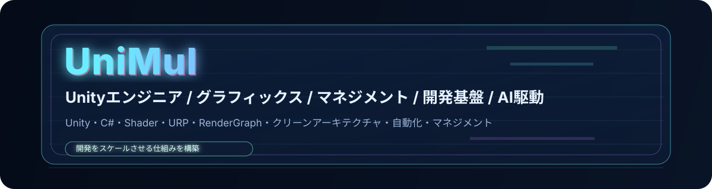

# UniMul

Unityエンジニア / グラフィックス / マネジメント / 開発基盤 / AI駆動開発  

---

> "開発をスケールさせる仕組みを構築 "

---

## やっていること
- Unityゲーム開発（C#）
- グラフィックス（HLSL / Shader / URP / RenderGraph）
- 設計（DDD / クリーンアーキテクチャ / MVP）
- 自動化 / 開発基盤
- マネジメント / チームスケール

## 技術スタック
Unity・C#・Shader・URP・RenderGraph・クリーンアーキテクチャ・自動化・マネジメント

## 📊 GitHub Stats

