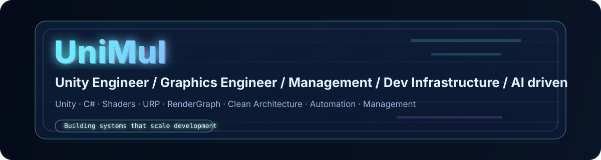

  <a href="./README.md">🇺🇸 English</a> | <a href="./README.ja.md">🇯🇵 日本語</a>

# Hi, I'm UniMul

Unity Engineer / Graphics Engineer / Management / Dev Infrastructure / AI-Driven Development  

---

> "Building systems that scale development"

---

## What I Do
- Unity Game Development (C#)
- Real-time Graphics (HLSL / Shader / URP / RenderGraph)
- Architecture Design (DDD / Clean Architecture / MVP)
- Automation & Development Infrastructure
- Engineering Management & Team Scaling

## Tech Stack
Unity · C# · Shaders · URP · RenderGraph · Clean Architecture · Automation · Management

## 📊 GitHub Stats

